# time-research-coding

## Framework



## Moudules

### ConfigParser

**Ability**

- Parse the config.

**Member**

- `ConfigParser`

### ConnectionHandler

**Ability**

- Handle the life-time of connections.
- Fetch data from the exchange.
- Buffer.

**Member**

- `RestApiHandler`
- `WebsocketHandler`

### Client

**Ability**

- Manage Sessions
- Buffer data

**Member**

## File Structure

```c++

```
