# time-research-coding

Author: Haonan Xue

In this project, we are going to develop a market data fetching system with asynchronized network IO operation.

Furthermore, some callbacks should be called once there is corresponding message recieved.

## Framework



## Moudules

| Module                | Ability                                                                                                     | Member                                            |
| --------------------- | ----------------------------------------------------------------------------------------------------------- | ------------------------------------------------- |
| `ConnectionHandler` | - Handle the life-time of connections.<br />- Fetch data from the exchange.                                 | `- RestApiHandler`<br />- `WebsocketHandler` |
| `ConnectionManager` | - Manage Connections.                                                                                      |                                                   |
| `Cache`             | - Buffer message.<br />- Deduplicate message.<br />- Provide data for consumer                           |                                                   |
| `Consumer`          | - Consume data in `Cache`.<br />- Provide interface (eg. `onOrderBookWS` and `onOrderBookREST`).    |                                                   |
| `Client`            | - Manage `ConnectionManager` , `Cache` and `Consumer.`<br />- Controll the async context and thread. |                                                   |

## File Structure

```bash
$ tree .
.
|-- CMakeLists.txt
|-- README.md
|-- answer_of_assignment1b.md
|-- app
|   |-- CMakeLists.txt
|   `-- main.cpp
|-- assignment.pdf
|-- config
|   |-- setup.ini
|   `-- subscription.ini
|-- docs
|   `-- ...
|-- include
|   |-- cache.h
|   |-- client.h
|   |-- common.h
|   |-- connection.h
|   |-- consumer.h
|   |-- nlohmann
|   |   |-- json.hpp
|   |   `-- json_fwd.hpp
|   |-- restapi.h
|   |-- utils
|   |   |-- logger.h
|   |   |-- parser.h
|   |   `-- queue.h
|   `-- websocket.h
|-- lib
|   `-- spdlog
|-- src
|   |-- CMakeLists.txt
|   |-- cache.cpp
|   |-- client.cpp
|   |-- connection.cpp
|   |-- consumer.cpp
|   |-- logger.cpp
|   |-- restapi.cpp
|   `-- websocket.cpp
|-- tests
|   `-- ...
`-- third_party
    |-- googletest
    |   `-- ...
    `-- inih
        `-- ...
```

## How to Run?

**Step 0**

Check the current working directory.

```bash
$ pwd
/workspace/time-research-coding
```

**Step 1**

Fetch the third-party submodule packages.

```bash
$ git submodule update --init --recursive
```

**Step 2**

Make directory `build` and walk into it. Set up `cmake` configuration and then build.

```bash
$ mkdir -p build && cd build
$ cmake ..
$ make -j4
```

**Step 3 (Optional)**

You can modify the callbacks of `onOrderBookWS` and `onOrderBookREST` in `app/main.cpp`.

Here is an example:

```c++
#include "client.h"


class DemoClient : public Client {	// Derive from the base Client class
  public:
	DemoClient(const std::string& name, const Client::Config& cfg_)
		: Client(name, cfg_) {};

	// Override this function according to you need.
	void onOrderBookWS(const OrderBook& orderBook) override {
		logger_->info("onOrderBookWS----[" + orderBook.symbol + "]  E: " + std::to_string(uint64_t(orderBook.data["E"])));
	}

	// Override this function according to you need.
	void onOrderBookREST(const OrderBook& orderBook) override {
		logger_->info("onOrderBookREST--[" + orderBook.symbol + "]  E: " + std::to_string(uint64_t(orderBook.data["E"])));
	}
};

int main() {
	Client::Config cfg = Client::Config::load_config("../config/setup.ini", "../config/subscription.ini");	// Load config
	DemoClient client("Demo", cfg);
	client.setup();
	client.run();
	return 0;
}
```

**Step 4 ( Optional)**

You can modify the configs in `config` .

In `config/setup.ini`, there are setups for client.

```ini
# config/setup.ini
[restapi]
replicas=1
period_second=1
host=fapi.binance.com
port=443

[websocket]
replicas=2
host=fstream.binance.com
port=443
```

In `config/subscription.ini` , there are symbols and channels for subscription.

```ini
# config/subscription.ini
[btcusdt]
depth = 5
[ethusdt]
depth = 20
```

Step 5

Once you lanch the program, the output should look like below:

```
$ pwd
/workspace/time-research-coding/build
$ ./app/main_exec 
[2024-11-13 19:12:14] [I] [Demo] Client is initializing
[2024-11-13 19:12:14] [I] [Demo] Client is setting up
[2024-11-13 19:12:14] [I] [Demo] endpoint_restapi: /fapi/v1/depth?symbol=btcusdt&limit=5
[2024-11-13 19:12:14] [I] [Demo] endpoint_ws: /ws/btcusdt@depth5
[2024-11-13 19:12:14] [I] [Demo] connection_manager setup! 
[2024-11-13 19:12:14] [I] [Demo] endpoint_restapi: /fapi/v1/depth?symbol=ethusdt&limit=20
[2024-11-13 19:12:14] [I] [Demo] endpoint_ws: /ws/ethusdt@depth20
[2024-11-13 19:12:14] [I] [Demo] connection_manager setup! 
[2024-11-13 19:12:14] [I] [Demo] Client is running
[2024-11-13 19:12:15] [I] [Demo] onOrderBookWS----[ethusdt]  E: 1731525135314
[2024-11-13 19:12:15] [I] [Demo] onOrderBookWS----[btcusdt]  E: 1731525135353
[2024-11-13 19:12:15] [I] [Demo] onOrderBookWS----[ethusdt]  E: 1731525135572
[2024-11-13 19:12:15] [I] [Demo] onOrderBookWS----[btcusdt]  E: 1731525135623
[2024-11-13 19:12:15] [I] [Demo] onOrderBookWS----[btcusdt]  E: 1731525135875
[2024-11-13 19:12:16] [I] [Demo] onOrderBookWS----[ethusdt]  E: 1731525136082
[2024-11-13 19:12:16] [I] [Demo] onOrderBookWS----[btcusdt]  E: 1731525136133
[2024-11-13 19:12:16] [I] [Demo] onOrderBookREST--[btcusdt]  E: 1731525136141
[2024-11-13 19:12:16] [I] [Demo] onOrderBookREST--[ethusdt]  E: 1731525136152
...
```
