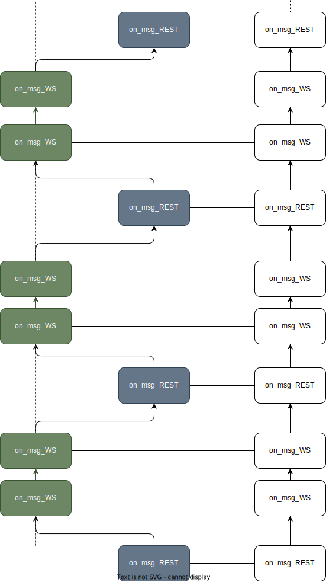

Answer of Assignment1b

## 1

Here is a diagram explaining the process when the program is running.

Actually there is an event loop, which is implemented with `boost:asio::io_context` in this implementation, managing the context switch between different events.

In each logical thread (highlighted with green and blue), the event will not trigger its corresponding callback immediatelly. It will be inserted to the end of the eventloop and then get consumed under the management of `boost::asio::io_context` later.

In fact, the cpu behaves as shown in the right-hand column of the diagram.

## 2

There are many points that could be bottlenecks.

**Context Switch**

There are many context switch between different logical thread, which leads to a lot of memory accesses. Therefore, the number of  **cache miss** and **page fault** should be monitored to evaluate the performance of the system.

**Overload/Underload**

If the buffer's utility is too high or the latency if too high, it may indicate some problems on the consumer's thread. If the CPU utility is too low, it indicates some problems on the producer thread. Therefore, **buffer's utility**  , **latency** and **CPU utility** should also be monitored.

**Lock Density**

Since there are many data access operation, lock should be applied. But with the density of lock increasing, the threads get stalled more frequently. Therefore, **Lock Density** should be monitored.

## 3

**Bind CPU Affinity**

Make less context switch in cpu runtime level.

**Reduce the overhead of asynchronous callbacks**

If the processing logic of a callback function is complex, try to simplify it to avoid unnecessary memory allocation or context switch in asynchronized operation.

**Merge multiple REST request**

Do many queries at one time.

**Faster Data Parser**

Current data parser is relatively naive. A faster parser could help a lot.

**Lock-Free Data Structures**

Lock-Free data structures can help reduce the lock density in the program.
